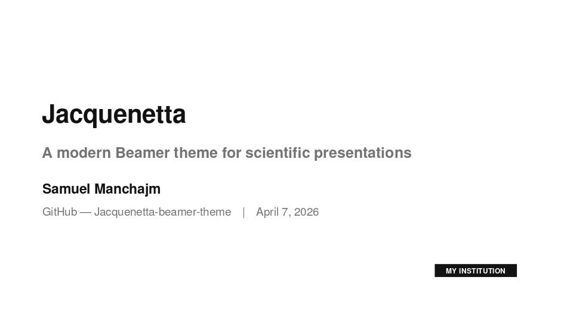
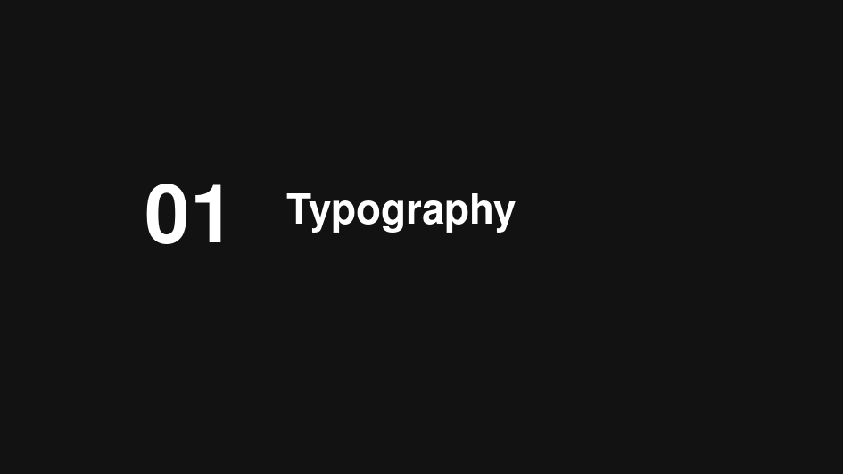
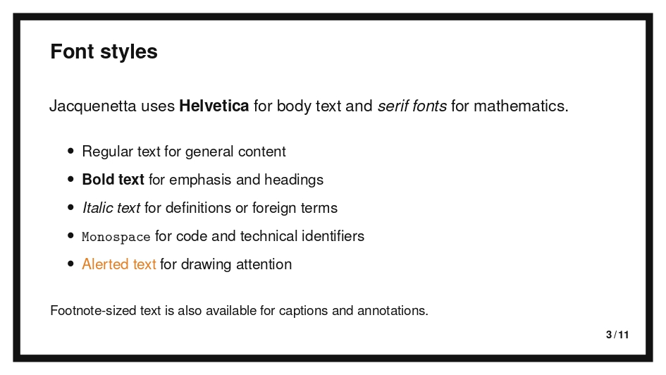

<div align="center">

# JacquenettaModified

**A modern, minimalist Beamer theme for scientific presentations**

`\usetheme{JacquenettaModified}`

[](https://creativecommons.org/licenses/by-sa/4.0/)
[](https://www.latex-project.org/)
[](https://www.linkedin.com/in/samuel-manchajm/)

</div>

---

<div align="center">


</div>

<div align="center">


</div>

---

JacquenettaModified is a clean, opinionated Beamer theme built for scientific talks in AI, ML, statistics, and related fields. Inspired by the JacquenettaModified Google Slides aesthetic. No clutter, no navigation bars, just your content with a strong visual identity.

## Highlights

- **Signature border** — thick dark frame on every slide, toggleable with `noborder`
- **Unified callout system** — every block type (standard, alert, example, problock, highlightbox) shares the same left-border language
- **Section dividers** — dark `\sectionframe` with large ghost number
- **Accent color** — fully configurable with any xcolor name
- **Serif math** — Helvetica body, Computer Modern for equations
- **X/N footer** — page count bottom-right, nothing else

## Installation

Copy the five `.sty` files from `src/` into your project directory:

```bash
cp src/*.sty /path/to/your/project/
```

Or install system-wide:

```bash
make install   # copies to ~/texmf/tex/latex/JacquenettaModified/
```

## Quick start

```latex
\documentclass[aspectratio=169]{beamer}
\usetheme{JacquenettaModified}

\title{Your Title}
\subtitle{Your Subtitle}
\author{Your Name}
\institute{Your Institution}
\date{\today}

\begin{document}

\titleframe

\sectionframe{01}{Introduction}

\begin{frame}{Your slide}
  \begin{problock}{Key result}
    Your content here.
  \end{problock}
\end{frame}

\thanksframe

\end{document}
```

```bash
pdflatex example.tex && pdflatex example.tex
```

## Theme options

```latex
\usetheme[accent=jqorange]{JacquenettaModified}   % orange accent
\usetheme[noborder]{JacquenettaModified}           % no signature border
\usetheme[accent=teal, noborder]{JacquenettaModified}
```

| Option | Description | Default |
|--------|-------------|---------|
| `accent=<color>` | Any xcolor name or theme alias | `jqblue` |
| `noborder` | Disable the signature dark border | off |

## Institution logo

Set a logo once in your preamble — it will appear automatically on the title page (bottom-right) and in the footer of every slide (bottom-left). If you don't set one, nothing changes.

```latex
\logo{\includegraphics[height=0.7cm]{logo.png}}
```

To show the logo only on the title page (not in the footer), clear it after `\titleframe`:

```latex
\titleframe
\logo{}   % remove from footer slides
```

## Commands

| Command | Description |
|---------|-------------|
| `\titleframe` | Title page (no border) with accent separator |
| `\thanksframe` | Dark closing slide — "Thank you." |
| `\thanksframe[Your text]` | Dark closing slide with custom text |
| `\sectionframe{N}{Title}` | Dark section divider with ghost number |

## Environments

All environments use the same left-border visual language.

```latex
% Standard Beamer blocks — safe inside [fragile] frames
\begin{block}{Title}         % accent border
\begin{alertblock}{Title}    % orange border
\begin{exampleblock}{Title}  % green border

% Custom environments — require tcolorbox, avoid in [fragile] frames
\begin{problock}{Title}      % accent border, richer content
\begin{highlightbox}         % orange border, no title
```

## Color palette

| Alias | Hex | Role |
|-------|-----|------|
| `jqdark` | `#121212` | Text, border, dark backgrounds |
| `jqgray` | `#757575` | Subtitles, annotations |
| `jqblue` | `#4A90E2` | Default accent |
| `jqorange` | `#E67E22` | Alerts, highlightbox |
| `jqgreen` | `#27AE60` | Example blocks |
| `jqaccent` | — | Alias for the current accent color |

Use anywhere: `\textcolor{jqorange}{...}` · `\color{jqaccent}`

## Requirements

Standard TeX Live 2020+ or MiKTeX 24+ installation. Required packages: `tikz`, `tcolorbox` (skins library), `helvet`, `microtype`, `setspace` — all included in a default distribution.

## License

This work is licensed under a [Creative Commons Attribution-ShareAlike 4.0 International License](https://creativecommons.org/licenses/by-sa/4.0/).

You are free to use, adapt, and redistribute this theme — including for commercial purposes — as long as you credit the original author and share any modifications under the same license.

2026 Samuel Manchajm
